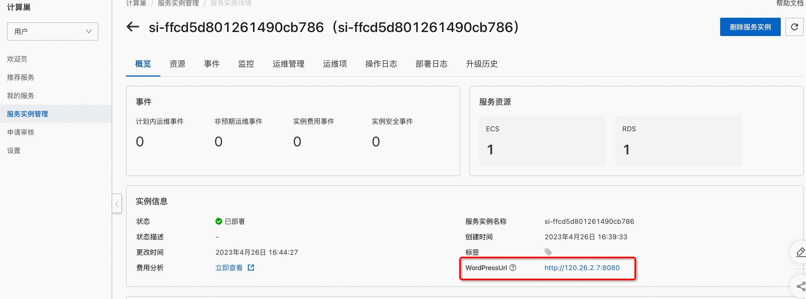
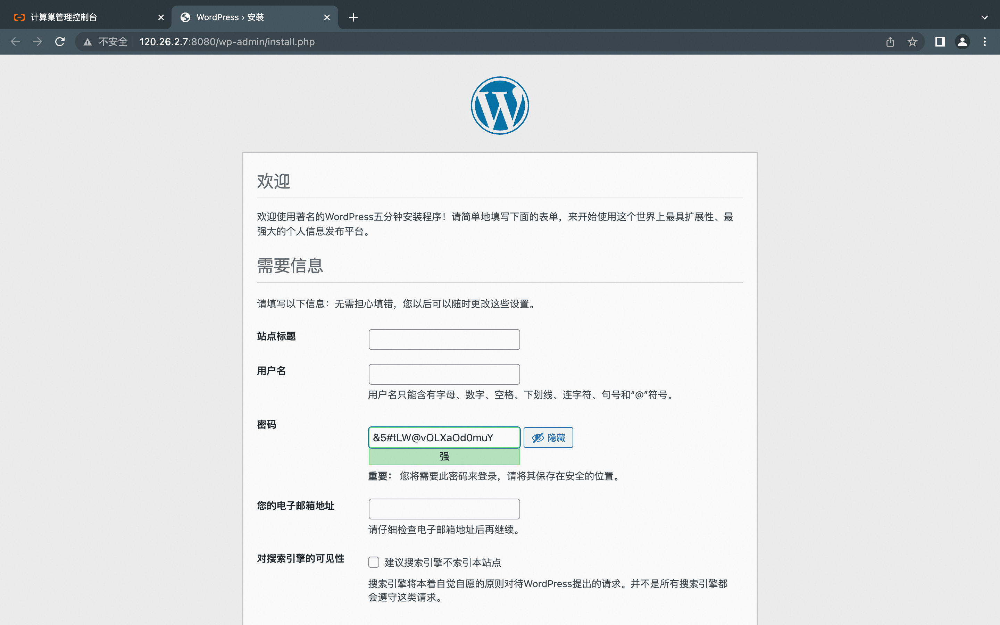

<h1>WordPress Community Edition Service Instance Deployment Document </h1>

<h2> Overview </h2>

WordPress is a free and open source website content management system (CMS) that can help users create and manage their own websites, including blogs, news websites, e-commerce websites, social networks, and more. WordPress
A rich library of themes and plugins makes it easy to customize the look and functionality of your site. WordPress's ease of use and scalability make it one of the most popular website building tools in the world. 

 the computing nest officially provides the WordPress community version service. you can quickly deploy the WordPress service on the computing nest without configuring the cloud host yourself, thus easily and quickly building your own website based on the WordPress. 

 This article describes how to activate the WordPress Community Edition service on the computing nest, as well as the deployment process and usage instructions. 

<h2> Billing instructions </h2>

 The cost of the WordPress in calculating the nest mainly involves:

<ul>
<li> Selected vCPU and Memory Specifications </li>
<li> System disk type and capacity </li>
<li> Internet bandwidth </li>
<li> Database configuration </li>
</ul>

 Billing methods include:

<ul>
<li> Pay-As-You-Go (hourly)</li>
<li> monthly package </li>
</ul>

 The estimated cost is visible in real time when the instance is created. 

<h2> Deployment Architecture </h2>

WordPress Community Edition has both standalone and multi-node deployment architectures. 

<h2> Permissions required for RAM accounts </h2>

<table>
<thead>
<tr>
<th> Permission policy name </th>
<th> Remarks </th>
</tr>
</thead>
<tbody>
<tr>
<td>AliyunECSFullAccess</td>
<td> Permissions to manage ECS </td>
</tr>
<tr>
<td>AliyunVPCFullAccess</td>
<td> Permissions for managing VPC networks </td>
</tr>
<tr>
<td>AliyunROSFullAccess</td>
<td> Manage permissions for Resource Orchestration Services (ROS) </td>
</tr>
<tr>
<td>AliyunRDSFullAccess</td>
<td> Permissions to manage ApsaraDB for RDS </td>
</tr>
<tr>
<td>AliyunSLBFullAccess</td>
<td> Permissions to manage the load balancing service (SLB) </td>
</tr>
<tr>
<td>AliyunComputeNestUserFullAccess</td>
<td> Manage user-side permissions for the compute nest service (ComputeNest) </td>
</tr>
<tr>
<td>AliyunCloudMonitorFullAccess</td>
<td> Permissions to manage CloudMonitor (CloudMonitor) </td>
</tr>
</tbody>
</table>

<h2> Deployment process </h2>

<h3> Deployment steps </h3>

 Click <a href = "https://computenest.console.aliyun.com/user/cn-hangzhou/serviceInstanceCreate?spm = 5176.24779694.0.0.3 a9c4d22RcCr2Q & ServiceId = service-bfee880fa3bf45c1a989"> Deployment Link </a> to enter the service instance deployment page, and fill in the parameters according to the prompts on the page to complete the deployment. 

<h3> Deployment parameters </h3>

 When you create a service instance, you need to configure the service instance information. The following describes the details of the stable-diffusion service instance input parameter. 

<table>
<thead>
<tr>
<th> Parameter group </th>
<th> Parameter item </th>
<th> Example </th>
<th> Description </th>
</tr>
</thead>
<tbody>
<tr>
<td> Select a template </td>
<td> Template Selection </td>
<td> Multi-node version </td>
<td> Template schema type </td>
</tr>
<tr>
<td> Service instance name </td>
<td></td>
<td>test</td>
<td> Name of the instance </td>
</tr>
<tr>
<td> Resource groups and regions </td>
<td> Resource group </td>
<td> Default resource group </td>
<td> The resource group where the created service instance is located                </td>
</tr>
<tr>
<td> Resource groups and regions </td>
<td> Region </td>
<td> China (Hangzhou)</td>
<td> Select the region of the service instance. We recommend that you select the region nearby to obtain better network latency.  </td>
</tr>
<tr>
<td> Payment type configuration </td>
<td> Payment type </td>
<td> Pay-As-You-Go or Subscription </td>
</tr>
<tr>
<td>ECS instance configuration </td>
<td> Instance type </td>
<td>ecs.gn6i-c4g1.xlarge</td>
<td> Instance type, which can be selected according to actual needs </td>
</tr>
<tr>
<td>ECS instance configuration </td>
<td> System disk space </td>
<td>40</td>
<td> System disk size, which can be selected according to actual needs </td>
</tr>
<tr>
<td>ECS instance configuration </td>
<td> Traffic payment type </td>
<td>PayByTraffic</td>
<td> Traffic payment type, which can be selected according to actual needs </td>
</tr>
<tr>
<td>ECS instance configuration </td>
<td> Internet traffic bandwidth </td>
<td>10</td>
<td> Traffic public network bandwidth, which can be selected according to actual needs </td>
</tr>
<tr>
<td>ECS instance configuration </td>
<td> Instance password </td>
<td><strong><em>*</strong></em></td>
<td> Set the instance password. It is 830 characters in length and must contain three items (uppercase letters, lowercase letters, numbers, ()'!@#$%^& *-+ ={}[]:;' <>, special symbols in.?/)</td>
</tr>
<tr>
<td> Load balancing configuration </td>
<td> Server Load Balancer Instance Specifications </td>
<td>slb.s2.small</td>
<td> The type of the load balancing instance can be selected according to actual needs. </td>
</tr>
<tr>
<td> Database configuration </td>
<td> Instance series </td>
<td> High Availability Edition </td>
<td>RDS instance series, which can be selected according to actual needs    </td>
</tr>
<tr>
<td> Database configuration </td>
<td> Instance specifications </td>
<td>mysql.n2.medium.1</td>
<td>RDS instance specifications, which can be selected according to actual needs   </td>
</tr>
<tr>
<td> Database configuration </td>
<td> Instance Storage </td>
<td>50</td>
<td> The size of the RDS instance, which can be selected based on actual needs. </td>
</tr>
<tr>
<td> Database configuration </td>
<td> Database name </td>
<td>wordpress</td>
<td>WordPress database name </td>
</tr>
<tr>
<td> Database configuration </td>
<td> Database account </td>
<td>wpuser</td>
<td>WordPress database account </td>
</tr>
<tr>
<td> Database configuration </td>
<td> Database password </td>
<td><strong><em>*</strong></em>*</td>
<td> Set the instance password. It is 830 characters in length and must contain three items (uppercase letters, lowercase letters, numbers, ()'!@#$%^& *-+ ={}[]:;' <>, special symbols in.?/)</td>
</tr>
<tr>
<td>WordPress configuration </td>
<td>WordPress listening port number </td>
<td>8080</td>
<td>WordPress website listening port number </td>
</tr>
<tr>
<td> Availability Zone Configuration </td>
<td> Deployment area </td>
<td> Availability Zone I</td>
<td> Different available regions in the region </td>
</tr>
<tr>
<td> Select an existing basic resource configuration </td>
<td>VPC ID</td>
<td>vpc-xxx</td>
<td> Select the ID of the VPC. </td>
</tr>
<tr>
<td> Select an existing basic resource configuration </td>
<td> Switch ID</td>
<td>vsw-xxx</td>
<td> Select the switch ID. If the switch cannot be found, try switching the region and zone. </td>
</tr>
</tbody>
</table>

<h3> Verify Results </h3>

<ol>
<li> View the service instance. After the service instance is created successfully, the deployment time takes about 6 minutes. After the deployment is complete, the corresponding service instance is displayed on the page.
</li>
<li> Access the WordPress through the service instance. After entering the corresponding service instance, you can WordPress the login URL on the page.
1.png" />
2.png" /></li>
</ol>

<h3> Use WordPress</h3>

 Please visit the WordPress official website to learn how to use the WordPress:<a href = "https://wordpress.com/zh-cn/support/getting-started-with-wordpress-com/">WordPress use documentation </a>

